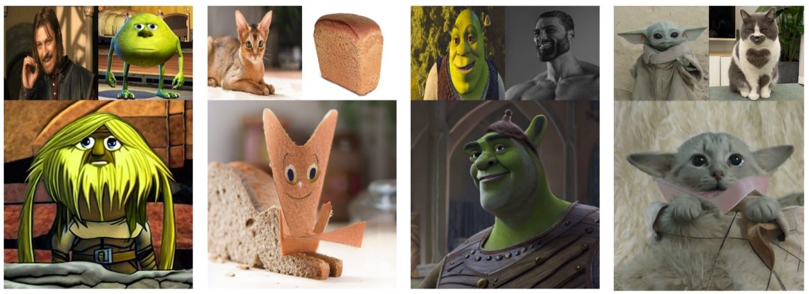
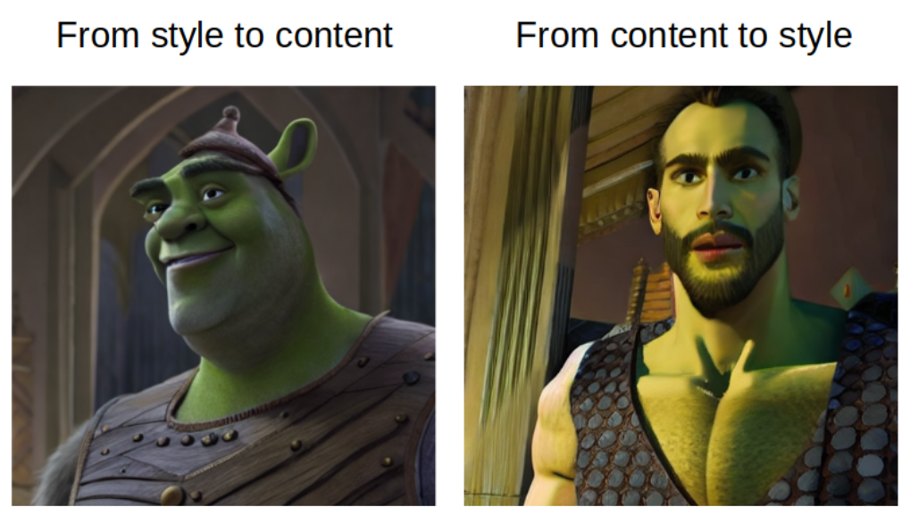

# CLIP Guided Images Mixing With Stable Diffusion
This approach allows you to combine two images using standard diffusion models.  
Modified and extended existing <a href="https://github.com/huggingface/diffusers/blob/main/examples/community/clip_guided_stable_diffusion_img2img.py">clip guided stable diffusion algorithm</a> to work with images.
<p>
     
</p> 

## Getting Started
```
git clone https://github.com/TheDenk/images_mixing.git
cd images_mixing

pip -r install requirements.txt
```

## Code examples description

All examples you can find in ./jupyters folder:  

| File Name | Description |  
|---|---|  
| <a href="https://github.com/TheDenk/images_mixing/blob/main/jupyters/example-no-CoCa.ipynb">example-no-CoCa.ipynb</a> | Short minimal example for images mixing. The weakness of this approach is that you should write prompts for each image.  |  
| <a href="https://github.com/TheDenk/images_mixing/blob/main/jupyters/example-stable-diffusion-2-base.ipynb">example-stable-diffusion-2-base.ipynb</a> | Example with stable-diffusion-2-base. For prompt generation CoCa is used.|  
| <a href="https://github.com/TheDenk/images_mixing/blob/main/jupyters/example-load-by-parts.ipynb">example-load-by-parts.ipynb</a> | Example where each diffusers module is loading separately. |  
| <a href="https://github.com/TheDenk/images_mixing/blob/main/jupyters/example-find-best-mix-result.ipynb">example-find-best-mix-result.ipynb</a> | Step by step explained how to get the parameters for mixing. (By complete enumeration of each parameter. xD) |  

## Short Method Description
Algorithm based on idea of <a href="https://github.com/huggingface/diffusers/blob/main/examples/community/clip_guided_stable_diffusion_img2img.py">clip guided stable diffusion img2img</a>. But with some modifications:  
  - Now two images and (optionaly) two prompts (description of each image) are expected.
  - Using interpolated (content-style) CLIP image embedding. (CLIP text embedding in original)
  - Using interpolated (content-style) text embedding for guidance. (text embedding in original)
  - (Optionaly) Using CoCa model for generation image description
### Using different coefficients you can select type of mixing: from style to content or from content to style. Parameters description see below.
`Style to prompt` and `Prompt to style` give different result. Example.
<p> 
     
</p> 

## Short Parameters Description
#### Each `slerp_` parameter has an impact on both images - style and content (more style - less content and and vice versa)
$content strength = 1.0 - stylestrength$

| Parameter Name | Description |  
|---|---|   
| **slerp_latent_style_strength** | parameter has an impact on start noised latent space. Calculate as spherical distance between latent spaces of style image and content image. |  
| **slerp_prompt_style_strength** | parameter has an impact on each diffusion iteration as usual prompt and for clip-guided algorithm. Calculate with CLIP text model as spherical distance between clip text embeddings of style prompt and content prompt. |  
| **slerp_clip_image_style_strength** | parameter has an impact on each diffusion iteration for clip-guided algorithm. Calculate with CLIP image model as spherical distance between clip image embeddings of style image and content image. |  
| **noise_strength** | just noise coefficient. Less value - more original information from start latent space. Recommended minimum value - 0.5, maximum - 0.7. |  

### From style to content recommended start parameters:
```
noise_strength=0.5
slerp_latent_style_strength=0.8
slerp_prompt_style_strength=0.2
slerp_clip_image_style_strength=0.2
```

### From content to style recommended start parameters:
```
noise_strength=0.5
slerp_latent_style_strength=0.2
slerp_prompt_style_strength=0.8
slerp_clip_image_style_strength=0.8
```

## Contacts
<p>Issues should be raised directly in the repository. For professional support and recommendations please <a>welcomedenk@gmail.com</a>.</p>
